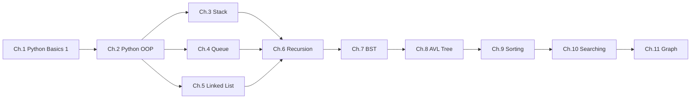

# 📚 01076110 Object Oriented Data Structures

> A comprehensive collection of Python implementations covering fundamental data structures and algorithms — from basic Python programming to advanced tree structures, sorting, searching, and graphs.


---

## 📋 Table of Contents

| Chapter | Topic | Folder | Files |
|---------|-------|--------|-------|
| 1 | [Python Basics 1](#chapter-1--python-basics-1) | `chapter1/` | 5 |
| 2 | [Python Basics 2 (OOP)](#chapter-2--python-basics-2-oop) | `chapter2/` | 5 |
| 3 | [Stack](#chapter-3--stack) | `chapter3/` | 5 |
| 4 | [Queue](#chapter-4--queue) | `chapter4/` | 5 |
| 5 | [Linked List](#chapter-5--linked-list) | `chapter5/` | 5 |
| 6 | [Recursion](#chapter-6--recursion) | `chapter6/` | 5 |
| 7 | [Tree 1 — Binary Search Tree](#chapter-7--tree-1--binary-search-tree) | `chapter7/` | 5 |
| 8 | [Tree 2 — AVL Tree](#chapter-8--tree-2--avl-tree) | `chapter8/` | 5 |
| 9 | [Sorting](#chapter-9--sorting) | `chapter9/` | 2 |
| 10 | [Searching](#chapter-10--searching) | `chapter10/` | — |
| 11 | [Graph](#chapter-11--graph) | — | — |
| — | [Test 1 Review](#-test-1-review) | `test1/` | 5 |

---

## Chapter 1 — Python Basics 1

> Introduction to Python fundamentals — arithmetic, conditionals, loops, I/O, and collections.

| File | Description |
|------|-------------|
| `ch1_1.py` | Computes the **area of a circle** given user-input radius |
| `ch1_2.py` | **BMI calculator** — reads height/weight, classifies weight category |
| `ch1_3.py` | **Election tally system** — frequency array to count votes and find most popular candidate |
| `ch1_4.py` | **Odd number filter** — filters even numbers from a list using list comprehensions |
| `ch1_5.py` | **ASCII geometric pattern** — generates composite `#`, `.`, `+` patterns using nested loops |

**Key Concepts:** Data types, conditionals, loops, `input()`/`print()`, list comprehensions, frequency counting

---

## Chapter 2 — Python Basics 2 (OOP)

> Object-Oriented Programming, operator overloading, and algorithmic problem-solving.

| File | Description |
|------|-------------|
| `ch2_1.py` | **Calculator class** — operator overloading with `__add__`, `__sub__`, `__mul__`, `__truediv__` |
| `ch2_2.py` | **Spherical class** — encapsulation with volume & surface area calculations, `__str__` |
| `ch2_3.py` | **Modular position extraction** — filters string/sequence characters at multiples of a step |
| `ch2_4.py` | **3Sum problem** — finds all unique triplets summing to zero |
| `ch2_5.py` | **First repeating character** — hash table (`dict`) for O(1) lookup + scoring |

**Key Concepts:** Classes, `__init__`, dunder methods, operator overloading, encapsulation, hash tables

---

## Chapter 3 — Stack

> Stack (LIFO) implementations and real-world applications.

| File | Description |
|------|-------------|
| `ch3_1.py` | **Balanced parentheses checker** — validates matching `()`, `[]`, `{}` using a stack |
| `ch3_2.py` | **Monotonic stack** — processes weight/label pairs, pops lesser-weight items |
| `ch3_3.py` | **Candy match / combo counter** — stack with consecutive-triplet pattern cancellation |
| `ch3_4.py` | **Stack calculator** — expression engine with `+`, `-`, `*`, `/`, `DUP`, `POP` instructions |
| `ch3_5.py` | **Parking lot simulation** — bounded stack + auxiliary stack for arbitrary car retrieval |

**Key Concepts:** LIFO, stack operations, delimiter matching, monotonic stack, postfix evaluation, dual-stack manipulation

```
Stack Operations:
┌─────────┐
│  peek() │ ← Top
├─────────┤
│         │
├─────────┤
│         │
└─────────┘
  push()↑  pop()↑
```

---

## Chapter 4 — Queue

> Queue variants and applications — FIFO simulation, scheduling, constraint filtering, and BFS.

| File | Description |
|------|-------------|
| `ch4_1.py` | **Queue simulator** — processes `E` (enqueue) and `D` (dequeue) commands with state output |
| `ch4_2.py` | **Group formation** — constraint-based batching with color conflict rules + reject queue |
| `ch4_3.py` | **Bookshelf simulator** — queue-based shelf operations with **duplicate detection** |
| `ch4_4.py` | **Café scheduling** — two-barista system, dispatching orders by earliest availability + longest wait calculation |
| `ch4_5.py` | **BFS maze solver** — finds path from start (`F`) to exit (`O`) on a 2D grid using queue-based BFS |

**Key Concepts:** FIFO, enqueue/dequeue, circular queue, priority dispatching, constraint filtering, Breadth-First Search

```
Queue Operations:
enqueue() → [ rear ... ... front ] → dequeue()
```

---

## Chapter 5 — Linked List

> Singly, doubly, and circular linked list implementations with practical applications.

| File | Description |
|------|-------------|
| `ch5_1.py` | **Musical keynote sequence** — singly linked list with append, rename, delete, and **deduplication** |
| `ch5_2.py` | **Train transit line** — circular doubly linked list with bidirectional traversal and route distance |
| `ch5_3.py` | **Directed node graph** — intersection detection (in-degree > 1), cycle breaking, and multi-pointer swap-merge |
| `ch5_4.py` | **Playlist manager** — singly linked list for keynote sequences (similar to ch5_1) |
| `ch5_5.py` | **Browser history** — doubly linked list with `VISIT`, `BACK`, `FORWARD`, `REMOVE`, `CLEAR` navigation |

**Key Concepts:** Node traversal, pointer manipulation, circular linking, intersection detection, cursor-based navigation

```
Singly:    [A] → [B] → [C] → None
Doubly:    None ← [A] ⇄ [B] ⇄ [C] → None
Circular:  [A] → [B] → [C] → [A]  ↺
```

---

## Chapter 6 — Recursion

> Recursive algorithms — from basic patterns to backtracking and subset generation.

| File | Description |
|------|-------------|
| `ch6_1.py` | **Print 1 to N / N to 1** — head recursion vs. tail recursion |
| `ch6_2.py` | **String length calculator** — recursive character traversal with alternating symbol formatting |
| `ch6_3.py` | **Generate valid parentheses** — all well-formed combinations of N pairs via recursive backtracking |
| `ch6_4.py` | **Perket problem** — subset generation (0/1 backtracking) to minimize sourness-bitterness difference |
| `ch6_5.py` | **ASCII staircase** — recursive pattern printing supporting ascending & descending heights |

**Key Concepts:** Base case, recursive case, call stack, head vs. tail recursion, backtracking, subset generation

---

## Chapter 7 — Tree 1 · Binary Search Tree

> BST construction, validation, range operations, pathfinding, and tree merging.

| File | Description |
|------|-------------|
| `ch7_1.py` | **BST insert & depth finder** — recursive insertion + depth computation with 90° rotated tree visualization |
| `ch7_2.py` | **Array-to-BST reconstruction** — heap-index mapping (`2i+1`, `2i+2`) + BST **validity checker** |
| `ch7_3.py` | **Range trimming & sum** — prunes nodes outside `[low, high]` and computes sum of remaining nodes |
| `ch7_4.py` | **Treasure hunt game** — DFS pathfinding on BST to find treasure then escape node with state tracking |
| `ch7_5.py` | **BST merging** — grafts a second BST onto a leaf of the first, then validates merged tree's BST property |

**Key Concepts:** BST property, tree traversals (DFS/BFS), range operations, BST validation, subtree merging

```
        8
       / \
      3   10
     / \    \
    1   6    14
       / \   /
      4   7 13
```

---

## Chapter 8 — Tree 2 · AVL Tree

> Self-balancing AVL trees with rotations, order statistics, and application problems.

| File | Description |
|------|-------------|
| `ch8_1.py` | **AVL + k-th smallest** — self-balancing insertion with rotations + in-order k-th element search |
| `ch8_2.py` | **AVL with rebalance logging** — prints "Not Balance, Rebalance!" and tree state after each insertion |
| `ch8_3.py` | **Rotation classifier** — identifies and logs rotation types (LL, RR, LR, RL) during insertion |
| `ch8_4.py` | **Dungeon crawl simulation** — AVL tree traversal where player loses HP equal to node values along leftmost path |
| `ch8_5.py` | **Complete binary tree builder** — level-based construction with BST validation |

**Key Concepts:** Balance factor, single/double rotations (LL, RR, LR, RL), self-balancing BST, order statistics

```
Rotation Cases:
  LL → Right Rotate       RR → Left Rotate
  LR → Left-Right Rotate  RL → Right-Left Rotate
```

---

## Chapter 9 — Sorting

> Classic sorting algorithms implemented recursively.

| File | Description |
|------|-------------|
| `ch9_1.py` | **Bubble Sort** — fully recursive implementation (no loops) with nested recursion |
| `ch9_2.py` | **Straight Selection Sort** — recursive max-finding with step-by-step swap printing |

**Key Concepts:** Comparison-based sorting, recursive sort implementation, time complexity

| Algorithm | Best | Average | Worst | Stable |
|-----------|------|---------|-------|--------|
| Bubble Sort | O(n) | O(n²) | O(n²) | ✅ |
| Selection Sort | O(n²) | O(n²) | O(n²) | ❌ |

---

## Chapter 10 — Searching

> Searching algorithms and techniques.

📁 `chapter10/` — *Coming soon*

**Topics Covered:**
- Linear Search
- Binary Search
- Search in data structures

---

## Chapter 11 — Graph

> Graph data structures and algorithms.

📁 *Coming soon*

**Topics Covered:**
- Graph representation (adjacency list / matrix)
- BFS & DFS traversal
- Shortest path algorithms

---

## 📝 Test 1 Review

> Practice files for exam preparation covering Stack, Queue, and Linked List.

| File | Description |
|------|-------------|
| `stack1.py` | **Browser history navigation** — stack-based page tracking with `BACK` command |
| `stack2.py` | **Balanced parentheses checker** — validates matching brackets using stack |
| `queue1.py` | **Shop customer line** — queue simulation with `ENQUEUE`, `DEQUEUE`, `SIZE` commands |
| `linkllist1.py` | **Text editor** — doubly linked list supporting `type`, `delete`, `undo`, `redo` operations |
| `reverselinklist.py` | **Doubly linked list reversal** — forward `show()` and backward `reverse()` traversal |

---

## 🗂️ Project Structure

```
OOD/
├── 📁 chapter1/          # Python Basics 1
│   ├── ch1_1.py              # Circle area
│   ├── ch1_2.py              # BMI calculator
│   ├── ch1_3.py              # Election tally
│   ├── ch1_4.py              # Odd filter
│   └── ch1_5.py              # ASCII pattern
├── 📁 chapter2/          # Python Basics 2 (OOP)
│   ├── ch2_1.py              # Calculator class
│   ├── ch2_2.py              # Spherical class
│   ├── ch2_3.py              # Modular position
│   ├── ch2_4.py              # 3Sum problem
│   └── ch2_5.py              # Repeating char
├── 📁 chapter3/          # Stack
│   ├── ch3_1.py              # Balanced brackets
│   ├── ch3_2.py              # Monotonic stack
│   ├── ch3_3.py              # Candy combo
│   ├── ch3_4.py              # Stack calculator
│   └── ch3_5.py              # Parking lot
├── 📁 chapter4/          # Queue
│   ├── ch4_1.py              # Queue simulator
│   ├── ch4_2.py              # Group formation
│   ├── ch4_3.py              # Bookshelf
│   ├── ch4_4.py              # Café scheduler
│   └── ch4_5.py              # BFS maze solver
├── 📁 chapter5/          # Linked List
│   ├── ch5_1.py              # Keynote sequence
│   ├── ch5_2.py              # Train transit
│   ├── ch5_3.py              # Node graph merge
│   ├── ch5_4.py              # Playlist manager
│   └── ch5_5.py              # Browser history
├── 📁 chapter6/          # Recursion
│   ├── ch6_1.py              # Print 1-N / N-1
│   ├── ch6_2.py              # String length
│   ├── ch6_3.py              # Valid parentheses
│   ├── ch6_4.py              # Perket problem
│   └── ch6_5.py              # ASCII staircase
├── 📁 chapter7/          # Tree 1 (BST)
│   ├── ch7_1.py              # BST insert & depth
│   ├── ch7_2.py              # Array-to-BST
│   ├── ch7_3.py              # Range trim & sum
│   ├── ch7_4.py              # Treasure hunt DFS
│   └── ch7_5.py              # BST merging
├── 📁 chapter8/          # Tree 2 (AVL)
│   ├── ch8_1.py              # AVL + k-th smallest
│   ├── ch8_2.py              # Rebalance logging
│   ├── ch8_3.py              # Rotation classifier
│   ├── ch8_4.py              # Dungeon crawl
│   └── ch8_5.py              # Complete tree builder
├── 📁 chapter9/          # Sorting
│   ├── ch9_1.py              # Bubble Sort (recursive)
│   └── ch9_2.py              # Selection Sort (recursive)
├── 📁 chapter10/         # Searching (coming soon)
├── 📁 test1/             # Test 1 Review
│   ├── stack1.py             # Browser back nav
│   ├── stack2.py             # Balanced brackets
│   ├── queue1.py             # Shop queue
│   ├── linkllist1.py         # Text editor
│   └── reverselinklist.py    # DLL reversal
└── 📄 README.md
```

---

## 🚀 Getting Started

### Prerequisites

- Python 3.x

### Running a File

```bash
python chapter1/ch1_1.py
```

### Clone the Repository

```bash
git clone <repository-url>
cd OOD
```

---

## 📖 Learning Path



---

## 📊 Data Structures Complexity Overview

| Data Structure | Access | Search | Insert | Delete |
|---------------|--------|--------|--------|--------|
| Array / List | O(1) | O(n) | O(n) | O(n) |
| Stack | O(n) | O(n) | O(1) | O(1) |
| Queue | O(n) | O(n) | O(1) | O(1) |
| Linked List | O(n) | O(n) | O(1) | O(1) |
| BST (average) | O(log n) | O(log n) | O(log n) | O(log n) |
| AVL Tree | O(log n) | O(log n) | O(log n) | O(log n) |

---

<p align="center">
  Made with ❤️ for <strong>01076110 Object Oriented Data Structures</strong>
</p>
